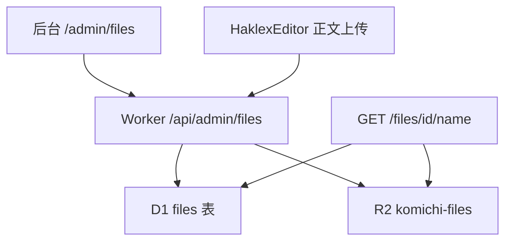

# 后台文件库

Feature Name: admin-file-manager
Updated: 2026-09-18

## Description

在 komichi 后台增加文件库。对象字节存放 Cloudflare R2，元数据存放 D1。管理员在 `/admin/files` 上传、筛选、复制公开 URL、删除。文稿/手记正文编辑器的图片/文件/视频上传写入同一库。访客通过 `/files/{id}/{filename}` 读取。

## Architecture

写入必须带 `ADMIN_TOKEN`。公开读取不鉴权。本地 Vite 把 `/api` 与 `/files` 都代理到 wrangler `8787`。

## Components and Interfaces

### Worker

- `POST /api/admin/files`：`multipart/form-data` 字段 `file`。校验 MIME 与大小后写入 R2（key = id），插入 D1，返回元数据与 `url`。
- `GET /api/admin/files?kind=&q=`：管理员列表，按 `created_at` 倒序。
- `DELETE /api/admin/files/:id`：先删 R2 再删 D1。
- `GET /files/:id/:filename`：按 id 查 D1，从 R2 读字节；`content-type` 用记录的 MIME；`cache-control` 长期缓存。

绑定：`env.FILES`（R2）、`env.DB`（D1）。

### 前端

- 路由 `/admin/files`，侧栏「总览」下方入口。
- `src/pages/FileManager.jsx`：上传（选择/拖放）、类型筛选、文件名搜索、卡片网格、复制链接、删除。
- `src/contentApi.js`：`listFiles` / `uploadFile` / `deleteFile`。
- `HaklexEditor`：`persistUploads` 为真时走 `uploadFile`，返回公开 URL；留言板保持 data URL。

## Data Models

D1 `files`：

- `id` TEXT PK（UUID）
- `name` TEXT 原始文件名（已清洗）
- `mime` TEXT
- `size` INTEGER 字节
- `kind` TEXT：`image` / `document` / `other`
- `created_at` TEXT ISO-8601

R2 key = `{folder}/{id}`。公开 URL = `/files/{id}/{urlencoded name}`，按 id 读取，文件夹改名不影响公开链接。

默认文件夹：未分类 / 图片 / 文档 / 其他。管理员可新建、改名、删除（删除后文件挪到「未分类」）。

大小上限：image 8 MiB，document 16 MiB，other 32 MiB。

允许 MIME：

- image：`image/jpeg` `image/png` `image/gif` `image/webp` `image/svg+xml`
- document：`application/pdf` `text/plain` `text/markdown`
- other：`audio/mpeg` `video/mp4` `application/zip`

## Correctness Properties

- 未持有有效口令的请求无法写入或列出文件库。
- 超限或非法 MIME 的文件不会写入 R2 或 D1。
- 删除成功后公开 URL 返回 404。
- 同一对象的公开路径以 `id` 为键，文件名变更不影响按 id 读取。

## Error Handling

- 401：缺少或错误的管理员口令
- 400：缺少文件、文件名为空
- 413：超过对应类型上限
- 415：MIME 不在允许列表
- 404：对象不存在
- 503：R2 绑定缺失

前端把上述错误展示为短句，上传失败不改正文。

## Test Strategy

- 本地 `wrangler d1 execute komichi --local --file=schema.sql` 建表。
- `POST /api/admin/files` 无口令 → 401；合法小图 → 201 且 `GET /files/...` 200。
- 超限文件 → 413；后台列表能看见新对象；删除后公开 URL 404。
- 后台文稿插入图片后 `src` 为 `/files/...`。

## References

- 当前工作区 `worker/index.js`：现有 admin session 与 documents CRUD
- 当前工作区 `worker/wrangler.toml`：D1 `komichi`，需增 R2 `FILES`
- 当前工作区 `src/pages/Editor.jsx`：侧栏与 `/admin*` 路由
- 当前工作区 `src/haklex/HaklexEditor.jsx`：现为 FileReader data URL 上传
