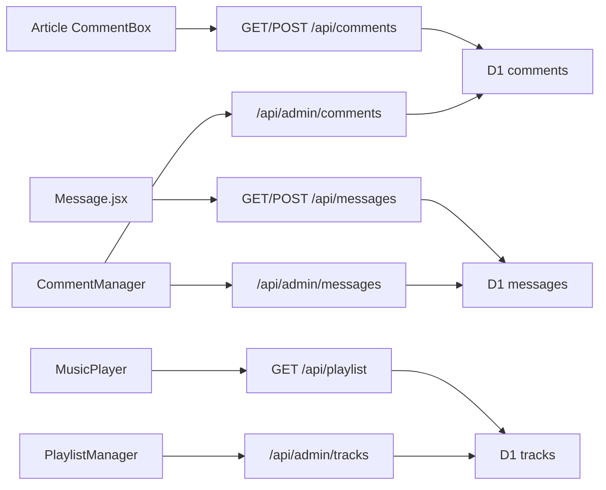

# 评论与侧边播放器

Feature Name: comments-playlist
Updated: 2026-09-22

## Description

文稿/手记评论落 D1 `comments`；全站留言仍用 `messages`。后台 `/admin/comments` 统一删除。歌单落 D1 `tracks`，前台 `MusicPlayer` 侧边弹窗播放，后台 `/admin/playlist` 维护。

## Architecture

首次请求 `migrateStudioSchema` 自动建 `comments` / `tracks`，远程 D1 不必先跑 schema 文件。

## Components and Interfaces

- `src/components/CommentBox.jsx`：复用 Haklex 评论编辑器，按 `kind`+`slug` 读写。
- `src/pages/CommentManager.jsx`：后台评论/留言列表与删除。
- `src/pages/PlaylistManager.jsx`：后台歌单增改删排序，可从文件库选音频。
- `src/components/MusicPlayer.jsx`：右下角入口 + 右侧抽屉。
- Worker：公开评论/歌单；管理删除走 Bearer。

## Data Models

`comments(id, target_kind, target_slug, nickname, content, created_at)`
`tracks(id, title, artist, cover, src, sort, created_at)`

`target_kind` 仅 `post` | `note`。手记 slug 用 `nid` 优先。

## Correctness Properties

- 公开写接口不鉴权，内容上限 2000，昵称上限 40。
- 歌单 `src`/`cover` 仅接受站内路径或 http(s) URL。
- 删除评论/留言/曲目为硬删。

## Error Handling

空内容、非法 kind/slug、超长、未登录分别返回 400/401。前台提示「没能留下痕迹，稍后再试。」

## Test Strategy

本地：文稿文末提交一条评论 → `/admin/comments` 可见并可删。后台加一首曲 → 首页右下角出现播放器。
