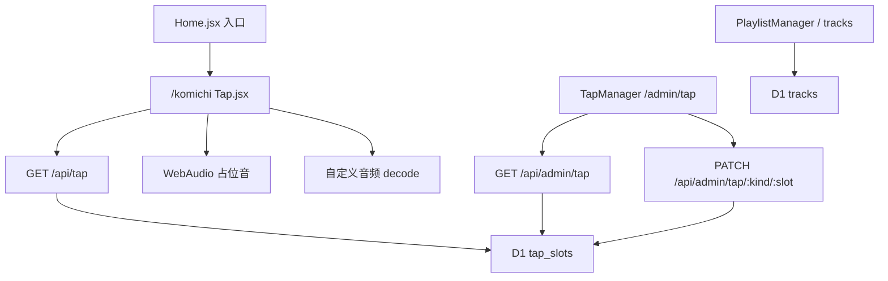

# Komichi Tap 点按小游戏

Feature Name: komichi-tap
Updated: 2026-09-23

## Description

独立全屏页 `/komichi`：点按、拖动、按键触发 32 个点按音与 Pastel 几何图案；11 条底轨可开关循环。默认用 Web Audio 合成占位音。管理员在 `/admin/tap` 为这 43 个槽绑定自定义音频。存储与歌单 `tracks` / `MusicPlayer` 分离。

## Architecture



`App.jsx` 对 `/komichi` 走与 `/admin*` 相同的独立全屏分支：不挂 Header、Footer、Background、MusicPlayer。首次请求 `migrateStudioSchema` 建 `tap_slots`。

## Components and Interfaces

### 前台

- `src/pages/Tap.jsx`：全屏页。开始层（开始 / 关于 / 底轨开关 / 返回首页）、游玩画布、键盘监听。
- `src/tap/engine.js`：Web Audio 上下文、32 点按占位音、11 底轨占位音、自定义音频加载与回退。
- `src/tap/visuals.js`：Canvas 2D 图案（圆、环、多边形、射线），颜色读 CSS 变量 `--accent` / `--n-*`。
- `src/tap/keymap.js`：`A–Z` → 槽 0–25；`[` `]` `;` `'` `,` `.` → 槽 26–31。
- `src/components/Header.jsx`：主导航增加「点按」到 `/komichi`。
- `src/App.jsx` 页脚「更多」列增加「点按」。
- `src/App.jsx`：`pathname === "/komichi"` 时只渲染 `<Tap />`。

### 后台

- `src/pages/TapManager.jsx`：两块列表（点按音 0–31、底轨 0–10），每槽显示名、音频地址、文件库选择、保存、清空。
- `src/pages/Editor.jsx`：侧栏「点按」链到 `/admin/tap`，crumbs 与 content 分支与歌单并列。
- `src/contentApi.js`：`listTapSlots`、`listAdminTapSlots`、`saveTapSlot`。

### Worker

- `GET /api/tap`：公开，返回 `{ hits: Slot[32], beds: Slot[11] }`。缺行用空 `src` 补齐。
- `GET /api/admin/tap`：需 Bearer，同上。
- `PATCH /api/admin/tap/:kind/:slot`：`kind` 为 `hit` 或 `bed`；`slot` 为整数，hit 0–31、bed 0–10。body `{ src?, label? }`。`src` 空字符串表示清空。

不提供 POST 追加、不提供 DELETE 删槽。

## Data Models

`tap_slots(kind TEXT, slot INTEGER, src TEXT, label TEXT, updated_at TEXT, PRIMARY KEY(kind, slot))`

- `kind`：`hit` | `bed`
- `slot`：hit 0–31，bed 0–10
- `src`：空为占位音；否则站内路径或 http(s)
- `label`：可选显示名，后台列表用，前台可不展示

公开响应示例：

```json
{
  "ok": true,
  "hits": [{ "slot": 0, "src": "", "label": "" }],
  "beds": [{ "slot": 0, "src": "", "label": "" }]
}
```

`hits` 长度 32、`beds` 长度 11，按 `slot` 升序，缺行补 `{ slot, src: "", label: "" }`。

## Correctness Properties

- Tap 页与歌单共用文件库音频文件，读写各自的表。
- `src` 校验复用 `tidyTrackUrl`：仅 `/` 开头或 `http://` / `https://`。
- 画布指针映射：将视口均分为 32 个横向条带（或 8×4 网格），落点所在格对应槽号。
- 拖动时仅在槽号变化时再触发一次音与图案。
- 底轨开：从 11 条中随机选一条循环；关：停止当前底轨。切换开关重新抽签。
- `prefers-reduced-motion: reduce` 时图案单帧或静止，音频仍播。
- 占位点按音时长 80–400ms；11 条底轨占位音彼此音高或波形可分辨。
- 默认不拉取对照站或第三方 OSS 音频。

## Error Handling

- 自定义音频 4xx/5xx、解码失败、CORS 失败：该槽改用占位音，游玩继续。
- `PATCH` 非法 `kind`/`slot`：400 `invalid_slot`。
- `src` 格式非法：400 `invalid_src`。
- 未带 Bearer 访问 `/api/admin/tap*`：401。
- `GET /api/tap` 在 D1 不可用时返回 32+11 空槽，前台全走占位音。

## Test Strategy

1. 打开首页，点入口进入 `/komichi`：无页头页脚，Pastel 背景。
2. 点「开始」，点按、拖动、按 `A` 与 `[` 均出声出图。
3. 开底轨有循环声，关则停。
4. `/admin/tap` 给 hit 0 填文件库 mp3 并保存；刷新 `/komichi` 后按 `A` 播该文件。
5. 清空 hit 0 后再按 `A` 回到占位音。
6. 歌单 `/admin/playlist` 曲目数量不变。
7. `prefers-reduced-motion` 下仍出声，图案不连续运动。

## References

[^1]: (Website) - [Joitap 对照页](https://tap.vjoi.cn/)
[^2]: (Filename) - [歌单设计](.monkeycode/specs/comments-playlist/design.md)
[^3]: (Filename) - [Worker 路由](worker/index.js)
[^4]: (Filename) - [后台侧栏](src/pages/Editor.jsx)
[^5]: (Filename) - [App 独立后台分支](src/App.jsx)
