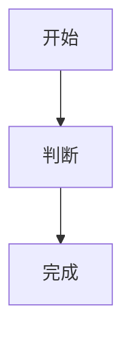

对照官方 [haklex /nodes](https://haklex.innei.dev/nodes)。写法见 `docs/HAKLEX.md`。

## 行内

这句里有 **重点**、*语气*、~~划掉~~、++下划线++、||剧透||、`行内代码`。

爱因斯坦方程是 $E=mc^2$。水是 H~2~O。面积是 πr^2^。

日文注音：<ruby>漢字<rt>かんじ</rt></ruby> 与 <ruby>東京<rt>とうきょう</rt></ruby>。

看 {github@innei} 和 [小路]{github@komichi}。标签：<tag>AI</tag>。这句话带脚注。[^1]

[^1]: 脚注会收在文末。

## 图片与视频


<video src="https://interactive-examples.mdn.mozilla.net/media/cc0-videos/flower.mp4" poster="https://picsum.photos/1280/720?random=302" width="1280" height="720" />

## 代码

```ts
type User = {
  id: string
  name: string
}

function hello(name: string) {
  return `Hello, ${name}`
}
```

<code-snippet>
<file name="index.ts" lang="ts">export function hello(name: string): string {
  return `Hello, ${name}!`
}</file>
<file name="usage.ts" lang="ts">import { hello } from './index'
console.log(hello('World'))</file>
</code-snippet>

## 图



$$
\int_{-\infty}^{\infty} e^{-x^2} dx = \sqrt{\pi}
$$

<link-card url="https://github.com/Innei/haklex" title="Innei/haklex" description="Lexical 富文本编辑器" favicon="https://github.githubassets.com/favicons/favicon.svg" />

## 表格与待办

| 功能 | 状态 |
| --- | --- |
| Alert | 可用 |
| Mermaid | 可用 |
| 投票 | 可点 |

- [x] 已完成
- [ ] 待办

## 提示

> [!NOTE]
> 说明信息。

> [!TIP]
> 建议写法。

> [!IMPORTANT]
> 必看。

> [!WARNING]
> 注意。

> [!CAUTION]
> 危险操作。

::: note
横幅说明。
:::

::: tip
横幅建议。
:::

::: warning
横幅注意。
:::

::: caution
横幅危险。
:::

::: details{summary="点击展开"}
折叠起来的补充说明。
:::

## 图集与分栏

<gallery layout="grid">


</gallery>

<gallery layout="carousel">


</gallery>

<grid cols="2" gap="16px">
<cell><p>左栏</p></cell>
<cell><p>右栏</p></cell>
</grid>

## 投票与对话

<poll mode="single">
<question>更想看哪一类节点？</question>
<option>行内</option>
<option>块</option>
<option>容器</option>
</poll>

<chat variant="user-agent">
<participants>
<participant id="u1" kind="user" name="komichi" />
<participant id="a1" kind="agent" name="haklex" />
</participants>
<messages>
<message id="m1" participant="u1">正文能渲染 /nodes 那些节点吗？</message>
<message id="m2" participant="a1">能。Markdown 走 transformer，扩展节点用 LiteXML。</message>
</messages>
</chat>

## 嵌入、附件、嵌套

<embed url="https://www.youtube.com/watch?v=dQw4w9WgXcQ" source="youtube" />

<embed url="https://www.bilibili.com/video/BV1GJ411x7h7" source="bilibili" />

<attachment src="/covers/haklex-nodes.webp" name="haklex-nodes.webp" ext="webp" />

<nested-doc>
<h3>嵌套小节</h3>
<p>点卡片会全屏打开这段内容。</p>
<p>里面还可以写 <b>强调</b> 和链接卡之外的普通段落。</p>
</nested-doc>

<excalidraw><![CDATA[{"type":"excalidraw","version":2,"source":"https://excalidraw.com","elements":[{"id":"box-1","type":"rectangle","x":40,"y":40,"width":200,"height":90,"angle":0,"strokeColor":"#1e1e1e","backgroundColor":"#a5d8ff","fillStyle":"solid","strokeWidth":2,"strokeStyle":"solid","roughness":1,"opacity":100,"groupIds":[],"frameId":null,"roundness":{"type":3},"seed":1,"version":1,"versionNonce":1,"isDeleted":false,"boundElements":[{"id":"text-1","type":"text"}],"updated":1,"link":null,"locked":false},{"id":"text-1","type":"text","x":80,"y":70,"width":120,"height":28,"angle":0,"strokeColor":"#1e1e1e","backgroundColor":"transparent","fillStyle":"solid","strokeWidth":1,"strokeStyle":"solid","roughness":0,"opacity":100,"groupIds":[],"frameId":null,"roundness":null,"seed":2,"version":1,"versionNonce":2,"isDeleted":false,"boundElements":null,"updated":1,"link":null,"locked":false,"text":"haklex","fontSize":28,"fontFamily":1,"textAlign":"center","verticalAlign":"middle","containerId":"box-1","originalText":"haklex","lineHeight":1.25,"autoResize":true}],"appState":{"viewBackgroundColor":"#ffffff","gridSize":null},"files":{}}]]></excalidraw>


