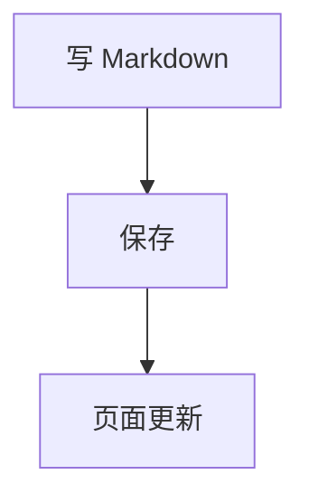
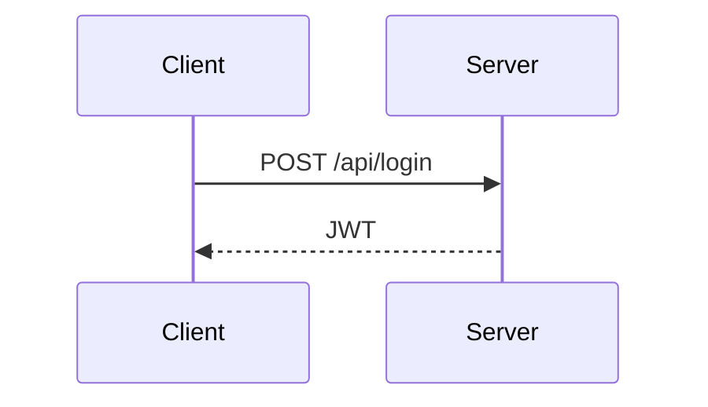
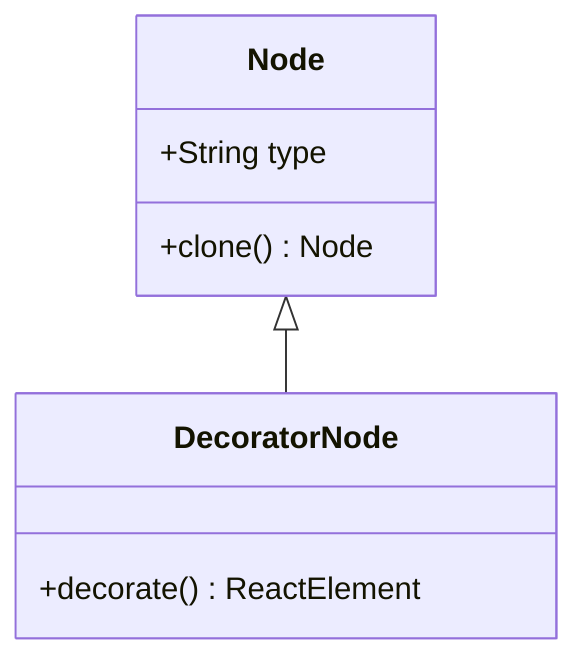

文件放 `content/posts/` 或 `content/notes/`，保存就会进页面。节点全貌在 [/posts/haklex-nodes](/posts/haklex-nodes)。字段模板见 `content/HOW_TO_WRITE.md`。

## 怎么读

目录只扫正文里的 `##` 和 `###`。同一节点的变体写成 `###`，当前节才会展开。封面写在文首 `cover`。LiteXML 标签单独成行，不要和普通句子挤在同一段。围栏里的内容一律当代码。

### 写法

标签、属性、单独成行这些规矩。

### 源码

围栏里的原文，页面当代码显示，不会再解析。

### 成品

围栏下面同一段真实节点。

## 文件和网址

文稿文件名就是网址：`content/posts/haklex.md` → `/posts/haklex`。手记网址用 `nid`：`nid: 220` → `/notes/220`。

```md
---
title: "文章标题"
date: "2026-09-10"
category: 技术
tags: [haklex, Markdown]
summary: 一句话摘要
cover: /covers/desk.jpg
---

## 第一节

正文。
```

## 行内

日常段落按 Markdown 写。行内还能用粗体、斜体、删除线、下划线、剧透、行内代码、上下标、行内公式。

源码：

```md
这句里有 **重点**、*语气*、~~划掉~~、++下划线++、||剧透|| 和 `行内代码`。
水是 H~2~O，面积是 πr^2^。爱因斯坦方程是 $E=mc^2$。
```

成品：

这句里有 **重点**、*语气*、~~划掉~~、++下划线++、||剧透|| 和 `行内代码`。
水是 H~2~O，面积是 πr^2^。爱因斯坦方程是 $E=mc^2$。

## 提及、注音、标签、注释、脚注

提及写成 `{平台@handle}` 或 `[显示名]{平台@handle}`。平台名用 `github`、`twitter`、`telegram`、`zhihu`。`handle` 只能是字母数字、点、连字符。

注音用 `<ruby>漢字<rt>かんじ</rt></ruby>`。标签用 `<tag>AI</tag>`。注释 `<!-- ... -->` 会变成 HTML 注释，页面上看不见。脚注在句末写 `[^1]`，文末写 `[^1]: 出处`。

源码：

```md
看 {github@innei} 和 [小路]{github@komichi}。
日文注音：<ruby>漢字<rt>かんじ</rt></ruby>。
标签：<tag>AI</tag>。
可见文字<!--草稿备注-->还在。
这句话带脚注。[^1]

[^1]: 脚注会收在文末。
```

成品：

看 {github@innei} 和 [小路]{github@komichi}。
日文注音：<ruby>漢字<rt>かんじ</rt></ruby>。
标签：<tag>AI</tag>。
可见文字<!--草稿备注-->还在。
这句话带脚注。[^guide]

[^guide]: 脚注会收在文末。

## 图片

封面仍写在 front matter 的 `cover`。正文插图一行一个。点图会全屏放大。地址无效时居中显示错误。

### Markdown 插图

源码：

```md

```

成品：


### LiteXML 布局

`layout` 用 `align-left` / `align-right` / `float-left` / `float-right`，`display-width` 是栏宽百分比（10–100）。

源码：

```xml

```

成品：


## 视频

标签单独成行。`src` 必填，`poster` / `width` / `height` 可选。

源码：

```xml
<video src="https://interactive-examples.mdn.mozilla.net/media/cc0-videos/flower.mp4" poster="https://picsum.photos/1280/720?random=302" width="1280" height="720" />
```

成品：

<video src="https://interactive-examples.mdn.mozilla.net/media/cc0-videos/flower.mp4" poster="https://picsum.photos/1280/720?random=302" width="1280" height="720" />

## 代码块

围栏开头写语言名。围栏里的 Markdown 不会再解析。

源码：

````md
```ts
function hello(name: string) {
  return `Hello, ${name}`
}
```
````

成品：

```ts
function hello(name: string) {
  return `Hello, ${name}`
}
```

## 多文件代码

`<code-snippet>` 里每个文件一个 `<file>`。`name` 和 `lang` 都要写。标签必须单独成行。

源码：

```xml
<code-snippet>
<file name="index.ts" lang="ts">export function hello(name: string): string {
  return `Hello, ${name}!`
}</file>
<file name="usage.ts" lang="ts">import { hello } from './index'
console.log(hello('World'))</file>
</code-snippet>
```

成品：

<code-snippet>
<file name="index.ts" lang="ts">export function hello(name: string): string {
  return `Hello, ${name}!`
}</file>
<file name="usage.ts" lang="ts">import { hello } from './index'
console.log(hello('World'))</file>
</code-snippet>

## 图

围栏语言写成 `mermaid`。本站引擎接得住 flowchart、sequence、class、state、ER、XY chart。

### 流程图

源码：

````md

````

成品：


### 时序图

源码：

````md

````

成品：


### 类图

源码：

````md

````

成品：


## 块公式

独立公式左右各空一行，用 `$$` 包住。行内公式用单个 `$...$`，里面不要换行。

源码：

```md
$$
\sum_{i=1}^{n} i = \frac{n(n+1)}{2}
$$
```

成品：

$$
\sum_{i=1}^{n} i = \frac{n(n+1)}{2}
$$

## 链接卡

`url` 必填。`title` / `description` / `favicon` / `image` 可选。标签单独成行。

源码：

```xml
<link-card url="https://github.com/Innei/haklex" title="Innei/haklex" description="Lexical 富文本编辑器" favicon="https://github.githubassets.com/favicons/favicon.svg" />
```

成品：

<link-card url="https://github.com/Innei/haklex" title="Innei/haklex" description="Lexical 富文本编辑器" favicon="https://github.githubassets.com/favicons/favicon.svg" />

## 表格与待办

表头下一行必须是 `| --- | --- |`。单元格里的 `|` 写成 `\|`。待办写成 `- [ ]` / `- [x]`。

源码：

```md
| 功能 | 状态 |
| --- | --- |
| Alert | 可用 |
| 投票 | 可点 |

- [x] 已完成
- [ ] 待办
```

成品：

| 功能 | 状态 |
| --- | --- |
| Alert | 可用 |
| 投票 | 可点 |

- [x] 已完成
- [ ] 待办

## 提示 Alert

GitHub Alert 类型要全大写，单独占一行。正文继续用 `>`。五种：`NOTE` / `TIP` / `IMPORTANT` / `WARNING` / `CAUTION`。

源码：

```md
> [!NOTE]
> 先把这件事说清楚。

> [!TIP]
> 常见写法放这里。

> [!WARNING]
> 会踩坑的地方。
```

成品：

> [!NOTE]
> 先把这件事说清楚。

> [!TIP]
> 常见写法放这里。

> [!WARNING]
> 会踩坑的地方。

## 横幅 Banner

容器写法：`::: tip` 开头，单独一行 `:::` 结束。别名：`info` → note，`success` → tip，`warn` → warning，`error` / `danger` → caution。

源码：

```md
::: tip
横幅适合短建议。
:::
```

成品：

::: tip
横幅适合短建议。
:::

## 折叠

`summary` 要用双引号。不写时标题是 `Details`。

源码：

```md
::: details{summary="点击展开"}
藏起来的说明。
:::
```

成品：

::: details{summary="点击展开"}
藏起来的说明。
:::

## 图集

`<gallery>` 里只放 ``。`layout` 三种：`grid` 均匀格子、`carousel` 横滑、`masonry` 高低错落。点图会全屏，图集里左右翻。

### 格子

源码：

```xml
<gallery layout="grid">


</gallery>
```

成品：

<gallery layout="grid">


</gallery>

### 砌体

源码：

```xml
<gallery layout="masonry">


</gallery>
```

成品：

<gallery layout="masonry">


</gallery>

## 分栏

`<grid>` 的孩子必须是 `<cell>`。`cols` 是列数，`gap` 写成 CSS 长度。格子里用 LiteXML 块，例如 `<p>`。

源码：

```xml
<grid cols="2" gap="16px">
<cell><p>左栏</p></cell>
<cell><p>右栏</p></cell>
</grid>
```

成品：

<grid cols="2" gap="16px">
<cell><p>左栏</p></cell>
<cell><p>右栏</p></cell>
</grid>

## 投票

一个 `<question>`，若干 `<option>`。`mode="single"` 单选，`mode="multiple"` 多选。现在能点，票数不会落到服务器。

### 单选

源码：

```xml
<poll mode="single">
<question>选一个</question>
<option>A</option>
<option>B</option>
</poll>
```

成品：

<poll mode="single">
<question>选一个</question>
<option>A</option>
<option>B</option>
</poll>

### 多选

源码：

```xml
<poll mode="multiple">
<question>养过哪些？</question>
<option>猫</option>
<option>狗</option>
<option>仓鼠</option>
</poll>
```

成品：

<poll mode="multiple">
<question>养过哪些？</question>
<option>猫</option>
<option>狗</option>
<option>仓鼠</option>
</poll>

## 对话

`<chat>` 必须有 `<participants>` 和 `<messages>`。`variant="user-agent"`：用户气泡、助手当正文。`variant="user-user"`：两边都是气泡。`participant` 的 `id` 要和 `message` 的 `participant` 对上。

### 用户与助手

源码：

```xml
<chat variant="user-agent">
<participants>
<participant id="u1" kind="user" name="komichi" />
<participant id="a1" kind="agent" name="haklex" />
</participants>
<messages>
<message id="m1" participant="u1">正文能渲染这些节点吗？</message>
<message id="m2" participant="a1">能。Markdown 走 transformer，扩展节点用 LiteXML。</message>
</messages>
</chat>
```

成品：

<chat variant="user-agent">
<participants>
<participant id="u1" kind="user" name="komichi" />
<participant id="a1" kind="agent" name="haklex" />
</participants>
<messages>
<message id="m1" participant="u1">正文能渲染这些节点吗？</message>
<message id="m2" participant="a1">能。Markdown 走 transformer，扩展节点用 LiteXML。</message>
</messages>
</chat>

### 双人气泡

源码：

```xml
<chat variant="user-user">
<participants>
<participant id="p_alice" kind="user" name="Alice" />
<participant id="p_bob" kind="user" name="Bob" />
</participants>
<messages>
<message id="m_uu_1" participant="p_alice">静态和编辑还是拆开做吗？</message>
<message id="m_uu_2" participant="p_bob">对，跟 code-snippet 同一套。</message>
</messages>
</chat>
```

成品：

<chat variant="user-user">
<participants>
<participant id="p_alice" kind="user" name="Alice" />
<participant id="p_bob" kind="user" name="Bob" />
</participants>
<messages>
<message id="m_uu_1" participant="p_alice">静态和编辑还是拆开做吗？</message>
<message id="m_uu_2" participant="p_bob">对，跟 code-snippet 同一套。</message>
</messages>
</chat>

## 嵌入

`url` 必填。`source` 可写 `youtube` / `bilibili`。标签单独成行。

源码：

```xml
<embed url="https://www.bilibili.com/video/BV1GJ411x7h7" source="bilibili" />
```

成品：

<embed url="https://www.bilibili.com/video/BV1GJ411x7h7" source="bilibili" />

## 附件

LiteXML 标签是 `<attachment>`，节点 type 是 `file`。`src` 和 `name` 要写，`ext` 可选。

源码：

```xml
<attachment src="/covers/desk.jpg" name="desk.jpg" ext="jpg" />
```

成品：

<attachment src="/covers/desk.jpg" name="desk.jpg" ext="jpg" />

## 嵌套文档

卡片点开后走全屏层，Esc 关闭。里面用 LiteXML 块（`<h3>`、`<p>`、`<b>`），不要在卡片里塞 Markdown `#` / `**`。

源码：

```xml
<nested-doc>
<h3>嵌套小节</h3>
<p>点卡片会全屏打开。</p>
</nested-doc>
```

成品：

<nested-doc>
<h3>嵌套小节</h3>
<p>点卡片会全屏打开。</p>
</nested-doc>

## 白板

`<excalidraw>` 的内容用 CDATA 包住快照 JSON。点开同样走全屏层，Esc 关闭。

源码：

```xml
<excalidraw><![CDATA[{"type":"excalidraw","version":2,"elements":[{"id":"box-1","type":"rectangle","x":40,"y":40,"width":200,"height":90,"angle":0,"strokeColor":"#1e1e1e","backgroundColor":"#a5d8ff","fillStyle":"solid","strokeWidth":2,"strokeStyle":"solid","roughness":1,"opacity":100,"groupIds":[],"frameId":null,"roundness":{"type":3},"seed":1,"version":1,"versionNonce":1,"isDeleted":false,"boundElements":[{"id":"text-1","type":"text"}],"updated":1,"link":null,"locked":false},{"id":"text-1","type":"text","x":80,"y":70,"width":120,"height":28,"angle":0,"strokeColor":"#1e1e1e","backgroundColor":"transparent","fillStyle":"solid","strokeWidth":1,"strokeStyle":"solid","roughness":0,"opacity":100,"groupIds":[],"frameId":null,"roundness":null,"seed":2,"version":1,"versionNonce":2,"isDeleted":false,"boundElements":null,"updated":1,"link":null,"locked":false,"text":"haklex","fontSize":28,"fontFamily":1,"textAlign":"center","verticalAlign":"middle","containerId":"box-1","originalText":"haklex","lineHeight":1.25,"autoResize":true}],"appState":{"viewBackgroundColor":"#ffffff"},"files":{}}]]></excalidraw>
```

成品：

<excalidraw><![CDATA[{"type":"excalidraw","version":2,"elements":[{"id":"box-1","type":"rectangle","x":40,"y":40,"width":200,"height":90,"angle":0,"strokeColor":"#1e1e1e","backgroundColor":"#a5d8ff","fillStyle":"solid","strokeWidth":2,"strokeStyle":"solid","roughness":1,"opacity":100,"groupIds":[],"frameId":null,"roundness":{"type":3},"seed":1,"version":1,"versionNonce":1,"isDeleted":false,"boundElements":[{"id":"text-1","type":"text"}],"updated":1,"link":null,"locked":false},{"id":"text-1","type":"text","x":80,"y":70,"width":120,"height":28,"angle":0,"strokeColor":"#1e1e1e","backgroundColor":"transparent","fillStyle":"solid","strokeWidth":1,"strokeStyle":"solid","roughness":0,"opacity":100,"groupIds":[],"frameId":null,"roundness":null,"seed":2,"version":1,"versionNonce":2,"isDeleted":false,"boundElements":null,"updated":1,"link":null,"locked":false,"text":"haklex","fontSize":28,"fontFamily":1,"textAlign":"center","verticalAlign":"middle","containerId":"box-1","originalText":"haklex","lineHeight":1.25,"autoResize":true}],"appState":{"viewBackgroundColor":"#ffffff"},"files":{}}]]></excalidraw>

## 远程组件

`<dynamic url="https://...">` 只接受 `https:` 地址，可选 `initial-height`，props 用 CDATA 包 JSON。本站还没有可 import 的小组件地址，样例页也先空着。

源码：

```xml
<dynamic url="https://example.com/widget.mjs" initial-height="140"><![CDATA[{"title":"Score"}]]></dynamic>
```

## 写作时记住这几条

1. 文稿文件名就是网址；手记网址用 `nid`
2. 右侧目录只扫 `##` / `###`
3. LiteXML 标签单独成行；围栏里的内容当代码
4. 图片、图集、封面点开会放大；嵌套文档和白板走全屏层
5. 完整效果对照 [/posts/haklex-nodes](/posts/haklex-nodes)
6. 完整标签表见 [LiteXML](https://github.com/Innei/haklex/blob/main/packages/rich-editor/docs/markdown-flavor-litexml.md)
