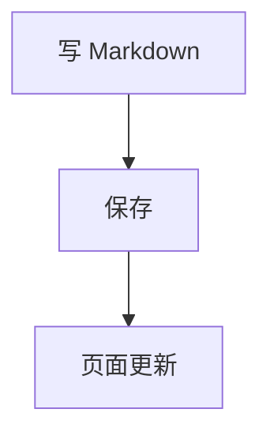

正文走 [haklex](https://haklex.innei.dev/nodes)。文件放 `content/posts/` 或 `content/notes/`，保存就会进页面。完整效果对照 [/posts/haklex-nodes](/posts/haklex-nodes)。

目录只认正文里的 `##` 和 `###`。封面写在文首 `cover`，插图写在正文里。

## 先写 Markdown

日常段落、列表、链接、代码、表格都按 Markdown 写。行内还能用这些：

这句里有 **重点**、*语气*、~~划掉~~、++下划线++、||剧透|| 和 `行内代码`。水是 H~2~O，面积是 πr^2^。爱因斯坦方程是 $E=mc^2$。

```md
这句里有 **重点**、*语气*、~~划掉~~、++下划线++、||剧透||。
水是 H~2~O。面积是 πr^2^。爱因斯坦方程是 $E=mc^2$。
```

提及写成 `{github@innei}` 或 `[小路]{github@komichi}`。平台名用 `github`、`twitter`、`telegram`、`zhihu`。注音用 `<ruby>漢字<rt>かんじ</rt></ruby>`。标签用 `<tag>AI</tag>`。注释 `<!-- 页面上看不见 -->` 不会出现在正文里。

插图：

```md

```

点图会全屏放大。图集里左右翻。

## 提示、折叠、公式

说明用 GitHub Alert，类型要全大写，单独占一行：

> [!NOTE]
> 先把这件事说清楚。

> [!TIP]
> 常见写法放这里。

> [!WARNING]
> 会踩坑的地方。

也可以写成横幅：

::: tip
横幅适合短建议。
:::

折叠补充：

::: details{summary="点击展开"}
藏起来的说明。`summary` 要用双引号。
:::

独立公式左右各空一行，用 `$$` 包住：

$$
\sum_{i=1}^{n} i = \frac{n(n+1)}{2}
$$

脚注在句末写 `[^1]`，文末写定义：

```md
这句话需要出处。[^1]

[^1]: 出处写在这里。
```

## 代码和图

围栏开头写语言名。围栏里的 Markdown 不会再解析。

```ts
function hello(name: string) {
  return `Hello, ${name}`
}
```

多文件并排用 `<code-snippet>`，标签必须单独成行：

<code-snippet>
<file name="index.ts" lang="ts">export function hello(name: string): string {
  return `Hello, ${name}!`
}</file>
<file name="usage.ts" lang="ts">import { hello } from './index'
console.log(hello('World'))</file>
</code-snippet>

流程图用 mermaid 围栏：



外链想做成卡片：

<link-card url="https://github.com/Innei/haklex" title="Innei/haklex" description="Lexical 富文本编辑器" favicon="https://github.githubassets.com/favicons/favicon.svg" />

## Markdown 写不出的节点

下面这些标签单独成行。不要和普通句子挤在同一段里。

图集、分栏：

```xml
<gallery layout="grid">


</gallery>

<grid cols="2" gap="16px">
<cell><p>左栏</p></cell>
<cell><p>右栏</p></cell>
</grid>
```

视频、嵌入、附件：

```xml
<video src="/clip.mp4" poster="/thumb.jpg" />
<embed url="https://www.bilibili.com/video/BV1GJ411x7h7" source="bilibili" />
<attachment src="/covers/desk.jpg" name="desk.jpg" ext="jpg" />
```

投票和对话：

```xml
<poll mode="single">
<question>选一个</question>
<option>A</option>
<option>B</option>
</poll>
```

嵌套文档点卡片会全屏打开，白板同样，Esc 关闭：

```xml
<nested-doc>
<h3>嵌套小节</h3>
<p>点卡片会全屏打开。</p>
</nested-doc>
```

`<dynamic url="https://...">` 只接受 https 地址。完整标签表见 [LiteXML](https://github.com/Innei/haklex/blob/main/packages/rich-editor/docs/markdown-flavor-litexml.md)。

## 写作时记住这几条

1. 文稿文件名就是网址：`content/posts/haklex.md` → `/posts/haklex`
2. 手记网址用 `nid`：`nid: 220` → `/notes/220`
3. 右侧目录只扫 `##` / `###`
4. LiteXML 标签单独成行；围栏里的内容当代码，不会再解析
5. 图片、图集、封面点开会放大；嵌套文档和白板走全屏层

对照页：[/posts/haklex-nodes](/posts/haklex-nodes)。字段怎么填见 `content/HOW_TO_WRITE.md`。
