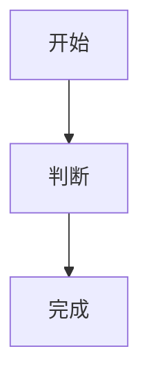
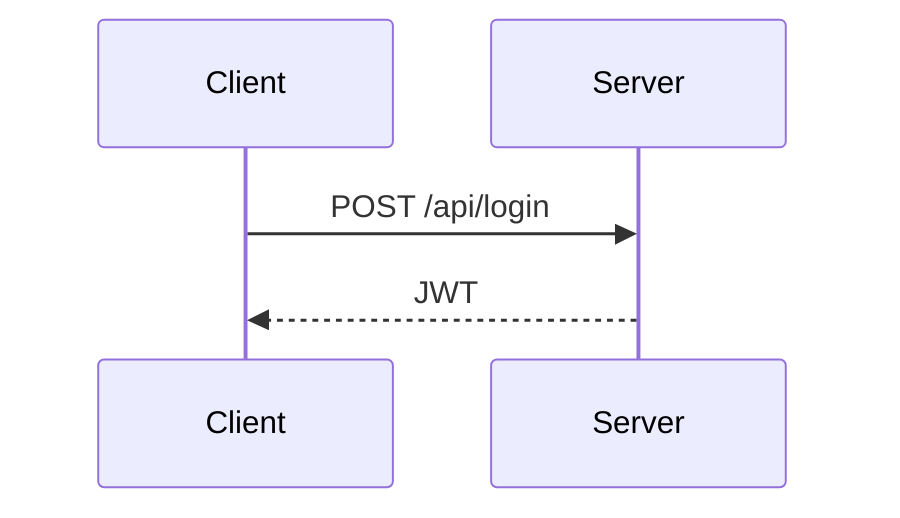
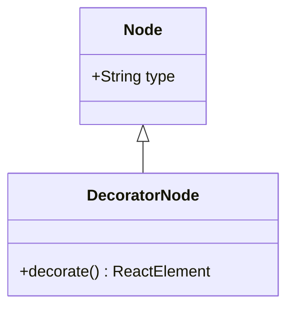

# haklex 节点写法

文稿、手记、关于页的正文走 `markdownToLexical`。`> [!NOTE]`、`::: banner` / `::: details`、`$$...$$` 先抬成 Lexical 节点；其余 Markdown 走 transformer；单独成行的 LiteXML 走 `@haklex/rich-litexml`。front matter、友人帐、项目、一言、思考仍按 `docs/CONTENT.md`。

- 使用文稿（写法 → 源码围栏 → 成品）：`/posts/haklex`
- 节点全貌样例：`/posts/haklex-nodes`
- 官方对照：https://haklex.innei.dev/nodes
- 导入入口：`src/haklex/markdown.js`

目录只认正文里的 `##` 和 `###`。LiteXML 标签必须单独成行。围栏里的内容当代码，不会再解析。

## 先用这些

标题、段落、列表、链接、图片、代码、引用、分割线、表格、待办、GitHub Alert、`::: banner` / `::: details`、公式、剧透、脚注。

## 文本

| 效果 | 写法 |
| --- | --- |
| 粗体 | `**粗体**` |
| 斜体 | `*斜体*` |
| 删除线 | `~~删除~~` |
| 行内代码 | `` `code` `` |
| 下划线 | `++下划线++` |
| 上标 | `^上标^` |
| 下标 | `~下标~` |
| 剧透 | `\|\|点开才看见\|\|` |
| 链接 | `[文字](https://example.com)` |
| 提及 | `[显示名]{github@handle}` 或 `{github@handle}` |
| 注释 | `<!-- 页面上看不见 -->` |
| 注音 | `<ruby>漢字<rt>かんじ</rt></ruby>` |
| 行内标签 | `<tag>AI</tag>` |
| 行内公式 | `$E=mc^2$` |

```md
这句里有 **重点**、*语气*、~~划掉~~、++强调++ 和 ||剧透||。
水的分子式是 H~2~O。面积公式是 πr^2^。
看 {github@innei} 和 [小路]{github@komichi}。
可见文字<!--草稿备注-->还在。
```

`handle` 只能是字母数字、点、连字符。平台名用 `github` / `twitter` / `telegram` / `zhihu`（也认 `gh` / `x` / `tw` / `tg` / `zh`）。注释会变成 HTML comment，只读页看不见。

## 标题、列表、引用、分割线

```md
## 第二节

### 小节

- 无序
1. 有序
- [ ] 待办
- [x] 已做

> 普通引用

---
```

分割线写成单独一行的 `---`、`***` 或 `___`。front matter 的 `---` 在正文之前，互不影响。

## 图片

```md


```

封面仍写在 front matter 的 `cover`。正文插图用上面这一行。点图会全屏放大，图集可左右翻。地址无效时居中显示错误。

LiteXML 还能控制宽度和位置：

```xml

```

`layout`：`align-left` / `align-right` / `float-left` / `float-right`。`display-width` 是栏宽百分比（10–100），与 `fixed-width` / `fixed-height` 互斥。

## 代码

围栏开头写语言名：

````md
```js
const n = 1
```
````

围栏里的 Markdown 不会再解析。

多文件并排：

```xml
<code-snippet>
<file name="index.ts" lang="ts">export {}</file>
<file name="usage.ts" lang="ts">console.log(1)</file>
</code-snippet>
```

`<file>` 的 `name` 和 `lang` 都要写。标签必须单独成行。

## 表格

```md
| 列一 | 列二 |
| --- | --- |
| A | B |
| C | D |
```

表头下一行必须是 `| --- | --- |`。单元格里的 `|` 写成 `\|`。

## 提示块

两种都能用。GitHub Alert 更稳。

```md
> [!NOTE]
> 说明

> [!TIP]
> 建议

> [!IMPORTANT]
> 必看

> [!WARNING]
> 注意

> [!CAUTION]
> 危险
```

类型必须全大写，单独占一行。正文继续用 `>`。

容器写法（横幅）：

```md
::: note
说明
:::

::: tip
建议
:::

::: important
必看
:::

::: warning
注意
:::

::: caution
危险
:::
```

容器别名：`info` → note，`success` → tip，`warn` → warning，`error` / `danger` → caution。

折叠：

```md
::: details{summary="点击展开"}
藏起来的内容
:::
```

`summary` 要用双引号。不写时标题是 `Details`。

## 公式

行内：

```md
爱因斯坦质能公式是 $E=mc^2$。
```

独立成块，左右各空一行：

```md
$$
\sum_{i=1}^{n} i = \frac{n(n+1)}{2}
$$
```

行内公式里不要换行，也不要再套一层 `$`。

## 脚注

正文里写 `[^id]`，文末写定义：

```md
这句话需要出处。[^1]

[^1]: 出处写在这里。
```

`id` 用字母数字。多条定义各占一行，会收进同一段脚注区。

## Mermaid

围栏语言写成 `mermaid`。本站引擎接得住 flowchart、sequence、class、state、ER、XY chart。pie / gantt / gitGraph / journey / mindmap / timeline 当前引擎画不出来。

````md





````

## 本站导入接得住的节点

| 节点 | 写法 | 对照 |
| --- | --- | --- |
| 标题 Heading | `#` `##` `###` | 目录只扫 `##` / `###` |
| 引用 Quote | `> ` | |
| 提示 Alert | `> [!NOTE]` 等 | `/posts/haklex` 提示节 |
| 横幅 Banner | `::: note` 等 | `/posts/haklex` 横幅节 |
| 折叠 Details | `::: details{summary="..."}` | `/posts/haklex` 折叠节 |
| 分割线 HR | `---` | |
| 图片 Image | `` 或 `` | 点开全屏；坏图居中报错 |
| 视频 Video | `<video src="..." />` | |
| 代码 CodeBlock | ` ```lang ` | |
| 多文件代码 | `<code-snippet>` | |
| 图 Mermaid | ` ```mermaid ` | flowchart / sequence / class |
| 链接卡 | `<link-card url="..." />` | |
| 表格 Table | 管道表 | |
| 待办 CheckList | `- [ ]` / `- [x]` | |
| 行内公式 | `$...$` | |
| 块公式 | `$$...$$` | |
| 剧透 Spoiler | `\|\|...\|\|` | |
| 脚注 | `[^id]` + `[^id]: ...` | |
| 下划线 | `++...++` | |
| 上标 / 下标 | `^...^` / `~...~` | |
| 提及 Mention | `{github@handle}` 等 | 平台映射见 `src/haklex/mentions.js` |
| 行内标签 Tag | `<tag>AI</tag>` | 站点自补 `TAG_IMPORT_TRANSFORMER` |
| 注音 Ruby | `<ruby>...<rt>...</rt></ruby>` | |
| 注释 Comment | `<!--...-->` | 只读页变成 HTML 注释 |
| 图集 Gallery | `<gallery layout="grid\|carousel\|masonry">` | 点图全屏，可左右翻 |
| 分栏 Grid | `<grid>` + `<cell>` | |
| 投票 Poll | `<poll mode="single\|multiple">` | 能点，票数不落库 |
| 对话 Chat | `<chat variant="user-agent\|user-user">` | |
| 嵌入 Embed | `<embed url="..." />` | youtube / bilibili |
| 附件 File | `<attachment src="..." name="..." />` | 节点 type 是 `file` |
| 嵌套文档 NestedDoc | `<nested-doc>` | 点开全屏，Esc 关 |
| 白板 Excalidraw | `<excalidraw>` + CDATA | 点开全屏，Esc 关 |
| 远程组件 Dynamic | `<dynamic url="https://..." />` | 只接受 https；样例暂空 |

## LiteXML 扩展节点

标签必须单独成行。不要和普通 Markdown 写在同一段里。标签名用规范写法：`<link-card>`、`<nested-doc>`、`<code-snippet>`、`<codeblock>`。

```xml
<video src="/clip.mp4" poster="/thumb.jpg" />

<link-card url="https://example.com" title="标题" description="简介" />

<code-snippet>
<file name="index.ts" lang="ts">export {}</file>
</code-snippet>

<gallery layout="grid">


</gallery>

<gallery layout="masonry">


</gallery>

<grid cols="2" gap="16px">
<cell><p>左</p></cell>
<cell><p>右</p></cell>
</grid>

<poll mode="single">
<question>选一个</question>
<option>A</option>
<option>B</option>
</poll>

<poll mode="multiple">
<question>养过哪些？</question>
<option>猫</option>
<option>狗</option>
</poll>

<chat variant="user-agent">
<participants>
<participant id="u1" kind="user" name="komichi" />
<participant id="a1" kind="agent" name="haklex" />
</participants>
<messages>
<message id="m1" participant="u1">正文能渲染这些节点吗？</message>
<message id="m2" participant="a1">能。Markdown 走 transformer，扩展节点用 LiteXML。</message>
</messages>
</chat>

<chat variant="user-user">
<participants>
<participant id="p_alice" kind="user" name="Alice" />
<participant id="p_bob" kind="user" name="Bob" />
</participants>
<messages>
<message id="m_uu_1" participant="p_alice">静态和编辑还是拆开做吗？</message>
<message id="m_uu_2" participant="p_bob">对，跟 code-snippet 同一套。</message>
</messages>
</chat>

<embed url="https://www.youtube.com/watch?v=dQw4w9WgXcQ" source="youtube" />

<attachment src="/covers/haklex-nodes.webp" name="haklex-nodes.webp" ext="webp" />

<nested-doc>
<h3>嵌套小节</h3>
<p>点卡片会全屏打开。</p>
</nested-doc>

<excalidraw><![CDATA[{"elements":[]}]]></excalidraw>

<tag>AI</tag>
```

提及平台名用 `github` / `twitter` / `telegram` / `zhihu`。点嵌套卡片或白板会全屏展开，Esc 关闭。`<dynamic>` 只接受 `https:` 地址，本站还没有可 import 的小组件，样例先空着。

`<agent-diff>` 在 LiteXML 表里有标签，compose 没有渲染器，正文不接。

完整标签表见 https://github.com/Innei/haklex/blob/main/packages/rich-editor/docs/markdown-flavor-litexml.md
